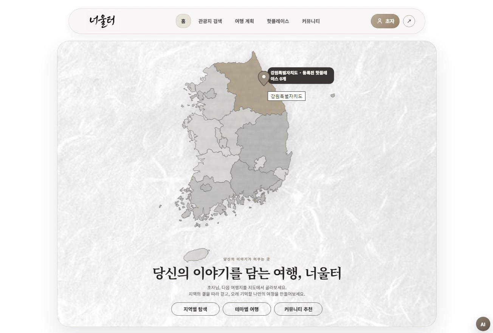
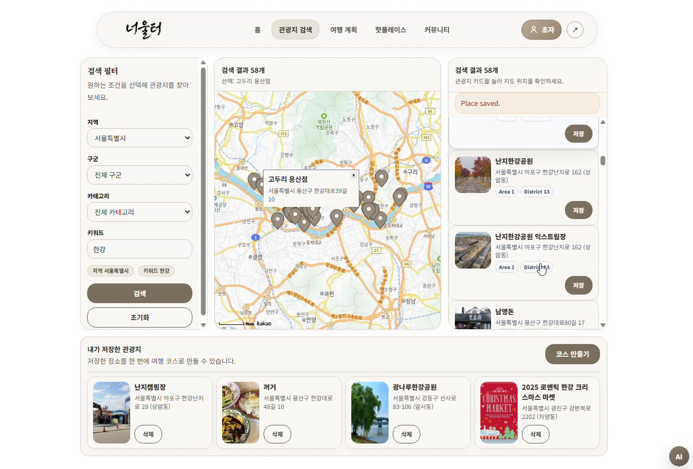
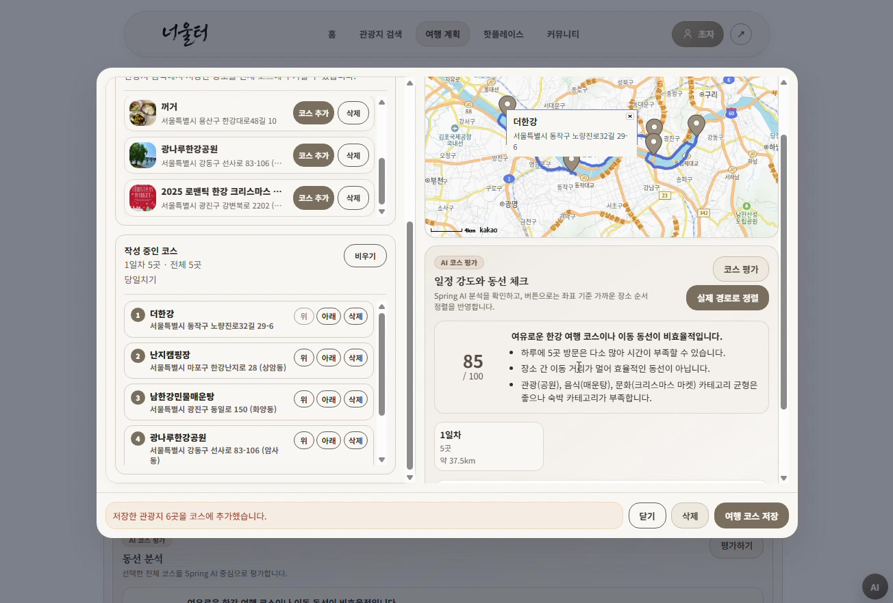
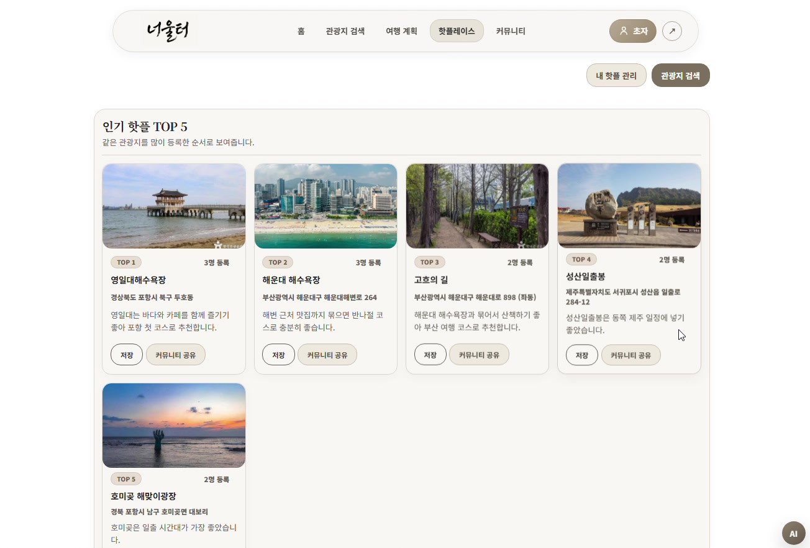
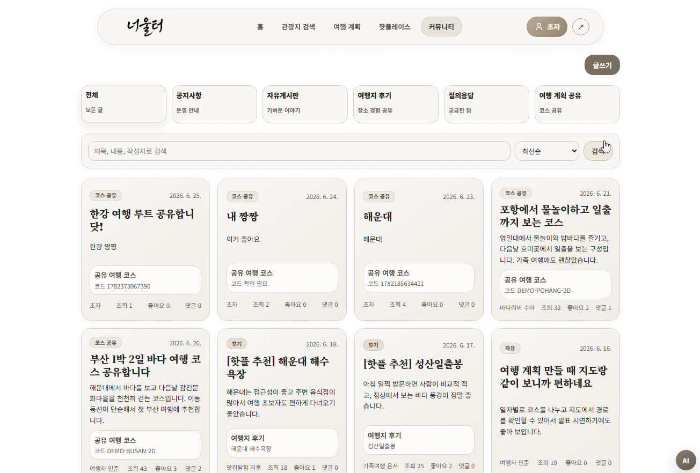
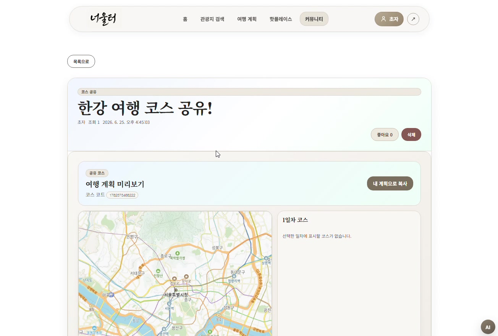

# Neoulteo

Neoulteo는 공공 관광 데이터, 지도, 사용자 기록, 커뮤니티, AI 추천을 하나로 묶은 여행 계획 웹 서비스입니다.

사용자는 지역별 관광지를 지도에서 탐색하고, 마음에 드는 장소를 저장해 일차별 여행 코스를 만들 수 있습니다. 다른 사용자의 핫플레이스와 여행 코스를 커뮤니티에서 공유할 수 있고, Spring AI 기반 여행 도우미를 통해 코스 피드백과 지역 추천을 받을 수 있습니다.

## 기능별 화면

| 홈 | 관광지 검색 |
| --- | --- |
|  |  |

| 여행 계획 | 핫플레이스 |
| --- | --- |
|  |  |

| 커뮤니티 | 여행 코스 공유 |
| --- | --- |
|  |  |

## 핵심 기능

### 1. 회원과 인증

- 회원가입, 로그인, 로그아웃
- JWT 기반 인증
- Spring Security 기반 접근 제어
- Remember-me 로그인 유지
- 프로필 조회, 이름 변경, 비밀번호 변경
- 회원 탈퇴

### 2. 관광지 검색

- 한국관광공사 TourAPI 기반 관광지 데이터 활용
- 지역, 구군, 카테고리, 키워드 조건 검색
- Kakao Map 마커 표시
- 관광지 리스트 클릭 시 지도 위치 이동
- 관광지 상세 정보를 여행 계획과 핫플레이스 기능에서 재사용

### 3. 여행 계획

- 여행 코스 생성, 수정, 삭제
- 관광지 선택 후 지도 마커로 코스 구성
- 1일차, 2일차, 3일차처럼 일차별 장소 관리
- 장소 순서 변경
- 도보/자동차 경로 표시를 위한 라우팅 API 연동 구조
- 여행 코스 공유 여부 설정
- 공유 코드로 다른 사용자의 여행 코스 가져오기
- AI 여행 계획 평가

### 4. 핫플레이스

- 내 핫플레이스 등록, 조회, 삭제
- 관광지를 기반으로 핫플레이스 등록
- 사용자 설명과 이미지를 함께 저장
- 많이 등록된 핫플레이스 상위 목록 제공
- 핫플레이스를 커뮤니티 글로 공유할 수 있는 흐름 제공

### 5. 커뮤니티

- 공지사항, 자유게시판, 여행 후기, Q&A, 여행 계획 공유 게시판
- 게시글 등록, 목록 조회, 상세 조회
- 댓글과 좋아요
- 이미지 업로드
- 공지사항은 관리자 계정만 작성 가능
- 여행 계획 공유글은 일반 게시글보다 카드형으로 강조

### 6. AI 기능

- Spring AI 기반 여행 챗봇
- RAG 기반 관광지 검색 보강
- Tool Calling 기반 기능 호출
  - 관광지 검색 Tool
  - 날씨 Tool 확장 포인트
  - 외부 여행 검색 Tool 확장 포인트
- 여행 계획 평가
  - 일정이 너무 빡센지 평가
  - 동선이 비효율적인지 평가
  - 카테고리 균형 평가
  - 일차별 피드백 생성
- FastAPI 기반 문서 RAG 서버

### 7. 관광지 데이터 배치

- Spring Batch 기반 TourAPI 동기화
- 콘텐츠 타입별 관광지 데이터 수집
- 기존 DB 데이터와 API 데이터 비교
- 신규/수정 관광지 반영
- 비교 결과 PDF 리포트 생성
- GMS OpenAI를 활용한 변경 결과 요약

## 기술 스택

| 영역 | 기술 |
| --- | --- |
| Frontend | Vue 3, Vite, Vue Router, JavaScript, pnpm |
| Backend | Spring Boot, Spring Security, Spring AI, Spring Batch |
| Database | MySQL, MyBatis |
| AI | Spring AI, RAG, Tool Calling, GMS OpenAI, FastAPI, ChromaDB |
| Map | Kakao Map JavaScript API, SVG Korea Map |
| Data | 한국관광공사 TourAPI |
| Auth | JWT, Remember-me Cookie |

## 프로젝트 구조

```text
neoulteo
├─ backend
│  ├─ src/main/java/com/neoulteo
│  │  ├─ domain          # 회원, 관광지, 핫플레이스, 여행계획, 커뮤니티
│  │  ├─ ai              # Spring AI, RAG, Tool Calling
│  │  ├─ batch           # TourAPI 동기화와 PDF 리포트
│  │  ├─ routing         # 경로 계산 API 연동
│  │  └─ global          # 보안, 공통 설정, 웹 설정
│  └─ src/main/resources
│     ├─ schema.sql
│     ├─ data.sql
│     └─ mappers
├─ frontend
│  ├─ src/pages          # 주요 페이지
│  ├─ src/components     # 공통 컴포넌트
│  ├─ src/api            # 백엔드 API 호출
│  ├─ src/router         # Vue Router
│  └─ src/styles         # 전역 스타일
├─ ai-server             # FastAPI 문서 RAG 서버
└─ docs                  # 실행 가이드, DB 스키마, 설계 문서, 이미지
```

## 주요 페이지

| 경로 | 설명 |
| --- | --- |
| `/` | 대한민국 SVG 지도 기반 홈 화면 |
| `/attractions` | 관광지 검색과 Kakao Map 마커 |
| `/plans` | 여행 계획 생성, 수정, 공유 코드 가져오기 |
| `/hotplaces` | 전체 핫플레이스 조회 |
| `/hotplaces/my` | 내 핫플레이스 관리 |
| `/community` | 커뮤니티 게시글 목록 |
| `/community/write` | 게시글 작성 |
| `/community/:id` | 게시글 상세 |
| `/profile` | 회원 정보 관리 |

## AI 동작 방식

Spring AI 기능은 단순 챗봇 응답만 만드는 구조가 아니라, 사용자의 질문을 분석한 뒤 필요한 도구를 호출하는 방식으로 동작합니다.

1. 사용자가 여행 질문을 입력합니다.
2. Spring AI가 질문 의도를 분석합니다.
3. 필요한 경우 관광지 검색 Tool이나 RAG 검색을 호출합니다.
4. DB 관광지 정보와 검색 결과를 프롬프트에 보강합니다.
5. GMS OpenAI 모델이 최종 답변을 생성합니다.

RAG는 관광지 데이터에서 관련 문서를 찾아 답변 근거로 사용하는 방식입니다. 덕분에 모델이 알고 있는 일반 지식만 사용하는 것이 아니라, 프로젝트 DB에 있는 관광지 정보를 바탕으로 답변할 수 있습니다.

## 실행 방법

실행과 초기 설정은 별도 문서에 정리했습니다.

- [실행 가이드](docs/RUN_GUIDE.md)
- [Spring AI Tool Calling 설명](docs/spring-ai-tool-module.md)
- [라우팅 API 설정](docs/routing-setup.md)

## 보안 설정

API 키와 로컬 설정 파일은 Git에 올리지 않습니다.

- `frontend/.env`
- `backend/src/main/resources/application-local.properties`
- `ai-server/.env`
- `storage/`
- `node_modules/`
- `.venv/`
- `target/`
- `dist/`

필요한 키는 실행 환경에서 직접 설정합니다.

- Kakao JavaScript Key
- GMS OpenAI Key
- TourAPI Service Key
- TMAP App Key

## 상태

이 프로젝트는 SSAFY 관통 프로젝트를 기반으로 개발한 여행 플랫폼입니다. 핵심 기능은 구현되어 있으며, 이후에는 추천 품질 개선, 경로 최적화, 관리자 기능, 테스트 코드 보강을 중심으로 확장할 수 있습니다.
