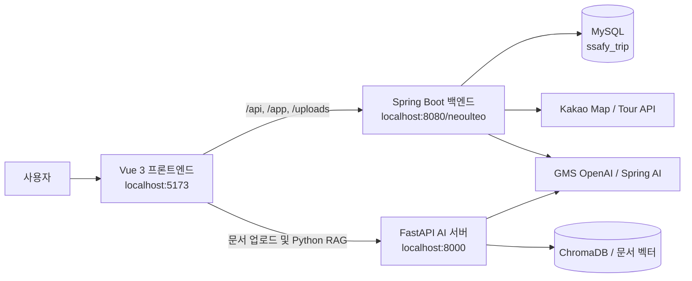

# Neoulteo 프로젝트 및 기능 명세

> 작성 기준: 2026-06-23 현재 저장소에 구현된 코드

## 1. 프로젝트 개요

**Neoulteo**는 공공 관광 데이터와 지도를 기반으로 관광지를 탐색하고, 사용자만의 핫플레이스와 일차별 여행 코스를 만들고 공유할 수 있는 여행 플랫폼이다.

사용자는 전국 지역 지도를 통해 여행지를 탐색하고, 관광지를 검색해 일차별 코스를 구성할 수 있다. 저장한 코스는 공유 코드 또는 커뮤니티 게시글로 다른 사용자에게 전달할 수 있으며, AI를 이용해 여행 코스를 평가하거나 관광 정보를 질문할 수 있다.

### 핵심 가치

- 공공 관광 데이터 기반의 신뢰할 수 있는 여행지 탐색
- Kakao Map을 이용한 위치 및 여행 동선 시각화
- 일차별 여행 계획 작성·저장·공유
- 사용자 추천 핫플레이스와 여행 커뮤니티
- Spring AI 및 FastAPI RAG를 활용한 여행 도우미

## 2. 시스템 구성



### 기술 스택

| 구분 | 기술 |
|---|---|
| Frontend | Vue 3, Vue Router, Vite, JavaScript, CSS |
| Map | Kakao Maps JavaScript SDK |
| Backend | Java 17, Spring Boot 3.3.5, Spring Security, Spring Batch, Spring AI |
| Persistence | MyBatis, MySQL 8 |
| AI server | Python, FastAPI, OpenAI API, sentence-transformers, ChromaDB |
| Document | pypdf, OpenHTMLToPDF |
| Package/build | pnpm, Maven |

## 3. 사용자별 기능

### 비로그인 사용자

- 홈 화면과 전국 지역 지도 조회
- 관광지 검색 및 지도 확인
- 공개 핫플레이스와 인기 핫플레이스 조회
- 공유된 여행 코스를 공유 코드로 조회
- 회원가입, 로그인, 비밀번호 재설정
- 공개 AI 여행 도우미 사용

### 로그인 사용자

- 프로필과 비밀번호 변경, 회원 탈퇴
- 관심 관광지 저장 및 삭제
- 내 핫플레이스 등록·수정·삭제
- 커뮤니티 게시글 목록 및 상세 조회
- 일차별 여행 코스 작성·수정·삭제
- 여행 코스 AI 평가 및 동선 재정렬 제안 적용
- 여행 코스 공유 설정, 공유 코드 복사, 공유 코스 복제
- 커뮤니티 글·댓글 작성 및 삭제, 게시글 좋아요
- 여행 계획 또는 핫플레이스를 커뮤니티에 공유

## 4. 화면별 기능

### 4.1 홈 (`/`)

- 대한민국 지역 지도 제공
- 지역 선택 시 해당 지역 정보와 공개 핫플레이스 표시
- 지역 조건을 유지한 관광지 검색 및 핫플레이스 화면 이동
- 전체 공개 핫플레이스 데이터 요약

### 4.2 관광지 검색 (`/attractions`)

- 시도, 구군, 관광 콘텐츠 유형, 키워드 복합 검색
- URL 쿼리를 이용한 지역 검색 조건 연동
- 적용 중인 검색 조건을 배지로 표시
- 검색 결과 카드와 Kakao Map 마커 연동
- 결과 카드 선택 시 해당 마커로 지도 이동 및 정보창 표시
- 모바일 환경에서 검색 필터 열기·닫기 지원

### 4.3 여행 계획 (`/plans`)

- 관광지 키워드 검색 후 코스에 장소 추가
- 여행 제목과 전체 여행 일수 설정
- 장소를 1일차, 2일차 등 일차별로 분류
- 일차 추가 및 여행 일수 변경
- 일차 내 방문 순서 변경과 장소 삭제
- 선택한 일차의 장소만 지도에 마커와 직선 경로로 표시
- 여행 계획 저장·수정·삭제
- 저장된 계획 목록과 일차별 장소 요약 제공
- 관광지 또는 핫플레이스를 관심 장소로 저장
- 저장한 관광지를 코스 작성 화면에서 재사용
- 코스 공유 활성화/비활성화 및 공유 코드 발급
- 공유 코드로 다른 사용자의 공개 코스 조회
- 공유 코스를 내 계획으로 복사
- 규칙 기반 거리·점수 분석과 Spring AI 코스 평가
- 가까운 좌표 기준의 동선 재정렬 제안 적용

> 현재 지도 경로는 실제 도로 길찾기가 아니라 장소 좌표를 순서대로 연결한 직선이다.

### 4.4 핫플레이스 (`/hotplaces`)

- 전체 또는 지역별 공개 핫플레이스 조회
- 조회수 기반 인기 핫플레이스 TOP 5 제공
- 핫플레이스의 이미지, 위치, 작성자, 방문일, 추천 설명 표시
- 핫플레이스를 관심 장소로 저장
- 선택한 핫플레이스 정보를 커뮤니티 글쓰기로 전달

### 4.5 내 핫플레이스 (`/hotplaces/my`)

- 기존 관광지 DB 검색 후 검증된 장소 선택
- 방문일과 추천 이유를 입력해 핫플레이스 등록
- 동일 사용자의 동일 관광지 중복 등록 방지
- 내가 등록한 핫플레이스 조회·수정·삭제

### 4.6 커뮤니티 (`/community`)

- 게시판 분류: 공지사항, 자유게시판, 여행지 후기, 질의응답, 여행 계획 공유
- 카테고리별 게시글 조회
- 제목·내용·작성자 키워드 검색
- 최신순, 조회수순, 좋아요순 정렬
- 제목, 내용 미리보기, 작성자, 작성일, 조회수, 좋아요, 댓글 수 표시

### 4.7 커뮤니티 글쓰기 (`/community/write`)

- 카테고리, 제목, 내용 입력
- 대표 이미지 업로드 및 미리보기
- 여행 계획 공유 글 작성 시 내 여행 계획 연결
- 핫플레이스 화면에서 제목·내용·이미지 정보를 전달받아 글 작성
- 공지사항은 설정된 관리자 이메일만 작성 가능

### 4.8 커뮤니티 상세 (`/community/:id`)

- 게시글 상세 내용과 대표 이미지 표시
- 조회수 증가 및 좋아요 토글
- 작성자 또는 관리자 게시글 삭제
- 댓글 목록, 댓글 작성, 본인 댓글 삭제
- 여행 계획 공유 글의 일차별 코스 표시
- 공유 코스의 일차 선택 및 장소 목록 확인
- 공유된 여행 계획을 내 계획으로 복사

### 4.9 마이페이지 (`/profile`)

- 로그인 사용자 이름과 이메일 표시
- 이름 변경
- 비밀번호 변경 및 이메일 기반 비밀번호 재설정
- 현재 비밀번호 확인 후 회원 탈퇴
- Tour API 수집 배치 수동 실행 및 결과 확인

### 4.10 AI 챗봇

- 화면 우측 하단에서 여행 질문 입력
- Spring AI 여행 도우미를 우선 호출
- 관광지 DB RAG 검색과 여행 도구 실행 결과를 결합한 답변
- 문서 업로드 후 FastAPI 기반 문서 RAG 질의응답
- AI 서버 오류 또는 비활성화 시 규칙/검색 결과 기반 대체 답변

## 5. 주요 백엔드 기능

### 회원 및 인증

- Spring Security 세션 로그인/로그아웃
- BCrypt 비밀번호 암호화
- 14일 유지되는 Remember Me 쿠키
- 회원가입, 내 정보 조회, 이름·비밀번호 변경, 회원 탈퇴
- 이메일과 새 비밀번호를 이용한 비밀번호 재설정
- 공개 API와 인증 필요 API 분리

### 관광지

- 시도 및 구군 목록 조회
- 지역, 구군, 관광 유형, 키워드 조건 검색
- 관광지 좌표, 주소, 이미지, 설명 제공

### 여행 계획

- 사용자별 계획 소유권 검증
- 여행 계획과 포함 장소를 트랜잭션으로 저장
- 장소별 `dayNo`를 이용한 일차 구분
- 공유 여부 관리와 공유 계획 공개 조회
- 공유 계획 복사 시 새로운 계획 ID 발급

### 커뮤니티

- 게시글 CRUD와 카테고리 검증
- 작성자/관리자 권한 검증
- 댓글 작성·조회·삭제
- 사용자별 게시글 좋아요 토글
- 여행 계획 공유 시 본인 계획인지 확인하고 공유 상태 활성화
- 최대 10MB 이미지 업로드 및 `/uploads/community/**` 정적 제공

### Tour API 배치

- 한국관광공사 Tour API 데이터 수집
- 기존 관광지와 신규·변경·누락·동일 항목 비교
- 비교 결과 DB 저장
- GMS AI를 통한 변경 내용 요약
- 배치 결과 PDF 보고서 생성
- Spring Batch 실행 이력 저장

## 6. AI 기능

### Spring AI

Spring Boot 내부 데이터와 도구를 이용하는 서비스 통합형 AI다.

- `AttractionTool`: 지역·키워드·콘텐츠 유형 기반 관광지 조회
- `WeatherTool`: 지역 날씨 정보 도구
- `TravelSearchTool`: 축제·행사 등 여행 정보 검색
- 관광지 DB 기반 RAG 검색
- 여행 코스 평가
- RAG 문서와 Tool 결과를 결합한 여행 도우미
- LLM 비활성화 또는 실패 시 대체 답변 제공

기본 설정은 `NEOULTEO_AI_ENABLED=false`이며 실제 LLM 호출에는 GMS OpenAI 키가 필요하다.

### FastAPI AI 서버

Python 생태계가 필요한 문서 검색과 벡터 RAG를 담당한다.

- PDF, TXT, Markdown 문서 업로드
- 문서 텍스트 추출 및 분할
- sentence-transformers 임베딩
- ChromaDB 벡터 저장 및 검색
- 일반 채팅, 문서 검색, 통합 RAG 채팅

## 7. 주요 API

백엔드 기본 주소는 `http://localhost:8080/neoulteo`이며, 개발 중 프론트엔드는 Vite 프록시를 통해 `/api`, `/app`, `/uploads` 요청을 전달한다.

| 도메인 | Method | Endpoint | 기능 | 인증 |
|---|---|---|---|---|
| Auth | POST | `/api/auth/login` | 로그인 | 공개 |
| Auth | POST | `/api/auth/logout` | 로그아웃 | 공개 |
| User | POST | `/api/users/signup` | 회원가입 | 공개 |
| User | GET/PATCH/DELETE | `/api/users/me` | 내 정보 조회·변경·탈퇴 | 필요 |
| Attraction | GET | `/api/attractions` | 관광지 검색 | 공개 |
| Attraction | GET | `/api/attractions/sidos` | 시도 목록 | 공개 |
| Attraction | GET | `/api/attractions/guguns` | 구군 목록 | 공개 |
| Hotplace | GET | `/api/hotplaces` | 공개 핫플레이스 조회 | 공개 |
| Hotplace | GET | `/api/hotplaces/popular` | 인기 핫플레이스 조회 | 공개 |
| Hotplace | GET/POST | `/api/hotplaces/me`, `/api/hotplaces` | 내 목록·등록 | 필요 |
| Hotplace | PATCH/DELETE | `/api/hotplaces/{id}` | 내 핫플레이스 수정·삭제 | 필요 |
| Saved place | GET/POST | `/api/saved-places` | 관심 장소 목록·저장 | 필요 |
| Saved place | DELETE | `/api/saved-places/{id}` | 관심 장소 삭제 | 필요 |
| Plan | GET/POST | `/api/plans` | 내 계획 목록·저장 | 필요 |
| Plan | GET/PATCH/DELETE | `/api/plans/{id}` | 계획 상세·수정·삭제 | 조건부/필요 |
| Plan | PATCH | `/api/plans/{id}/share` | 공유 상태 변경 | 필요 |
| Plan | GET | `/api/plans/shared/{id}` | 공유 계획 조회 | 공개 |
| Plan | POST | `/api/plans/{id}/copy` | 공유 계획 복사 | 필요 |
| Community | GET/POST | `/api/posts` | 게시글 목록·작성 | 필요 |
| Community | GET/PUT/DELETE | `/api/posts/{id}` | 게시글 상세·수정·삭제 | 필요 |
| Community | GET/POST | `/api/posts/{id}/comments` | 댓글 조회·작성 | 필요 |
| Community | POST | `/api/posts/{id}/like` | 좋아요 토글 | 필요 |
| Community | POST | `/api/posts/images` | 대표 이미지 업로드 | 필요 |
| AI | POST | `/app/ai/chat` | 기본 AI 채팅 | 공개 |
| AI | POST | `/app/ai/smart-travel-chat` | Tool 기반 여행 채팅 | 공개 |
| AI | POST | `/app/ai/evaluate-plan` | 여행 코스 평가 | 공개 |
| AI | POST | `/app/ai/travel-assistant` | RAG+Tool 여행 도우미 | 공개 |
| Batch | POST | `/api/batch/tour` | Tour API 배치 실행 | 필요 |

### FastAPI API

| Method | Endpoint | 기능 |
|---|---|---|
| POST | `/chat` | 일반 AI 채팅 |
| POST | `/search` | 벡터 문서 검색 |
| POST | `/integrated-chat` | 문서 검색 기반 통합 채팅 |
| POST | `/upload` | PDF/TXT/MD 문서 업로드 |

## 8. 데이터 구조

| 테이블 | 역할 |
|---|---|
| `users` | 회원 정보 |
| `sidos`, `guguns` | 시도·구군 지역 코드 |
| `contenttypes` | 관광 콘텐츠 유형 |
| `attractions` | 공공 관광지 데이터 |
| `hotplaces` | 사용자 핫플레이스 |
| `travel_plans` | 여행 계획 기본 정보 및 공유 상태 |
| `travel_plan_places` | 여행 계획 장소와 일차·순서 |
| `saved_places` | 사용자가 저장한 관심 관광지 |
| `posts` | 커뮤니티 게시글과 연결 계획·이미지 |
| `post_comments` | 게시글 댓글 |
| `post_likes` | 게시글 좋아요 |
| `tour_batch_reports` | Tour API 배치 비교·보고서 이력 |

## 9. 주요 디렉터리

```text
neoulteo/
├─ frontend/                 Vue 3 웹 클라이언트
│  └─ src/
│     ├─ api/                백엔드/FastAPI 호출 모듈
│     ├─ components/         지도, 챗봇, 공통 UI
│     ├─ pages/              라우트별 화면
│     ├─ stores/             인증 상태
│     └─ utils/              여행 코스 평가 로직
├─ backend/                  Spring Boot API 서버
│  └─ src/main/
│     ├─ java/com/neoulteo/
│     │  ├─ domain/          회원, 관광지, 핫플, 계획, 게시판
│     │  ├─ ai/              Spring AI, RAG, Tool
│     │  ├─ batch/           Tour API 수집·비교·PDF
│     │  └─ global/          보안, 공통 설정
│     └─ resources/          설정, 스키마, MyBatis 매퍼
├─ ai-server/                FastAPI 문서 RAG 서버
└─ docs/                     설계 문서, DB 마이그레이션, 이미지
```

## 10. 실행에 필요한 외부 설정

- MySQL `ssafy_trip` 데이터베이스
- 관광지 dump 데이터
- Kakao JavaScript 지도 키: `VITE_KAKAO_MAP_APP_KEY`
- Tour API 서비스 키: `TOUR_API_SERVICE_KEY`
- Spring AI 사용 시 GMS OpenAI 키: `GMS_OPENAI_API_KEY`
- FastAPI AI 사용 시 Python 패키지 및 GMS OpenAI 키

자세한 설치와 실행 명령은 루트의 `README.md`를 참고한다.

## 11. 현재 제약 및 확장 포인트

- 여행 코스 지도는 실제 도로가 아닌 좌표 간 직선 경로를 사용한다.
- Kakao Mobility Directions API 등을 연동하면 자동차·도보 경로로 확장할 수 있다.
- 날씨 및 외부 여행 검색 Tool은 API 키와 제공 서비스 설정에 따라 제한될 수 있다.
- Spring AI는 기본 비활성화 상태이므로 키가 없으면 대체 답변을 사용한다.
- FastAPI 문서 RAG 기능은 별도 AI 서버가 실행 중이어야 한다.
- Tour API 전체 수집은 호출량 제한을 고려해 지역·콘텐츠 유형 단위 실행이 필요하다.
- 운영 환경에서는 관리자 권한과 비밀번호 재설정 본인 인증을 강화해야 한다.
